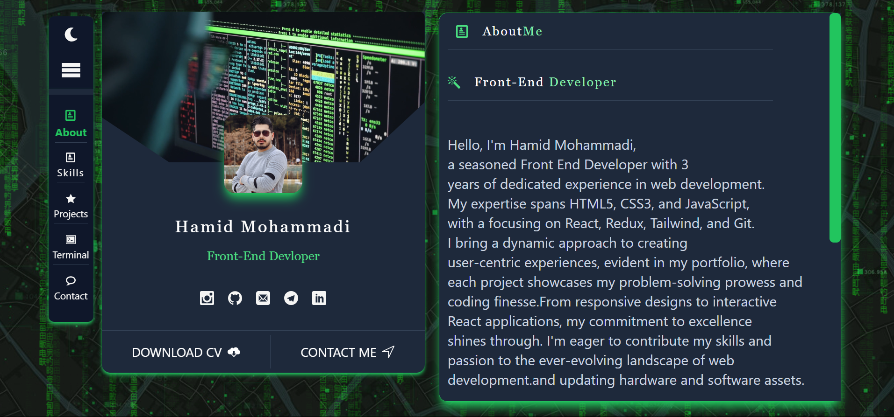
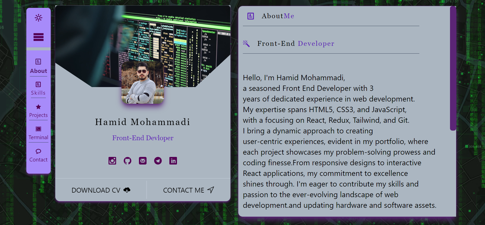
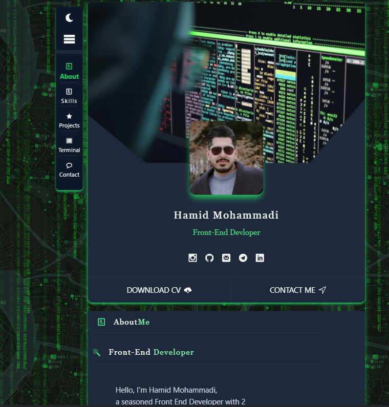
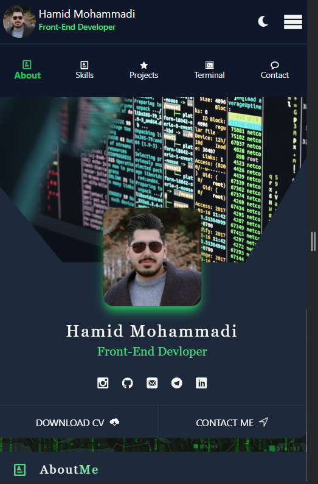

# Hamid Dev personal Website
## Live Preview
👉👉[Live Preview](https://portfolio-hamid-js.vercel.app/)👈👈
## images

## Overview
Welcome to my portfolio website! This platform is designed to showcase my projects, provide insights into my skills, and offer a glimpse into who I am as a developer. The website is built using Tailwind CSS and React JS, combining simplicity with modern design principles.

## Technologies Used

- **Tailwind CSS:** The styling of the website is powered by Tailwind CSS, allowing for a clean and responsive user interface.
- **React JS:** The website is built with React JS to create a dynamic and interactive user experience.
- **Other Technologies:** Various other technologies and libraries have been employed to enhance functionality and improve the overall user experience.

## Projects

Explore a collection of my projects featured on the website. Each project is accompanied by a brief description, showcasing the technologies used and the challenges addressed during development. Feel free to click on individual projects to learn more and view the live demos or source code.

## About Me

Get to know me better! The "About Me" section provides a glimpse into my background, skills, and passion for coding. Discover what motivates me, my approach to problem-solving, and my commitment to continuous learning and improvement.

## How to Navigate

1. **Home:** Explore an overview of my portfolio and recent projects.
2. **Projects:** Browse through detailed information about each project, including technologies used and relevant links.
3. **About Me:** Learn more about who I am, my journey into the world of coding, and my aspirations.

## Contact

Feel free to reach out if you have any questions, collaboration opportunities, or just want to connect. You can find my contact information on the website.

Thank you for visiting my portfolio! I hope you enjoy exploring my projects and learning more about my journey as a developer.
